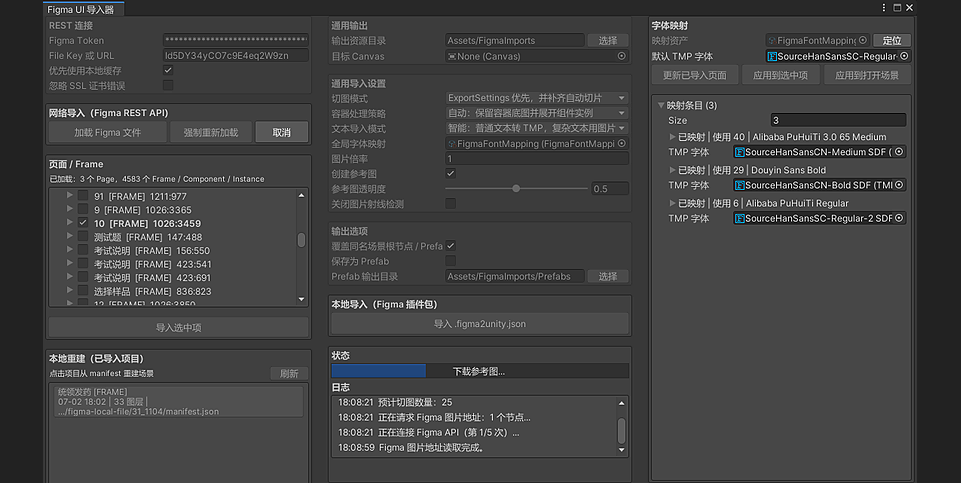
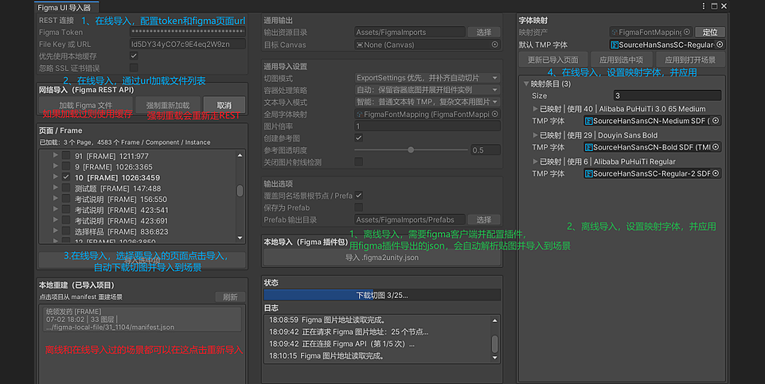
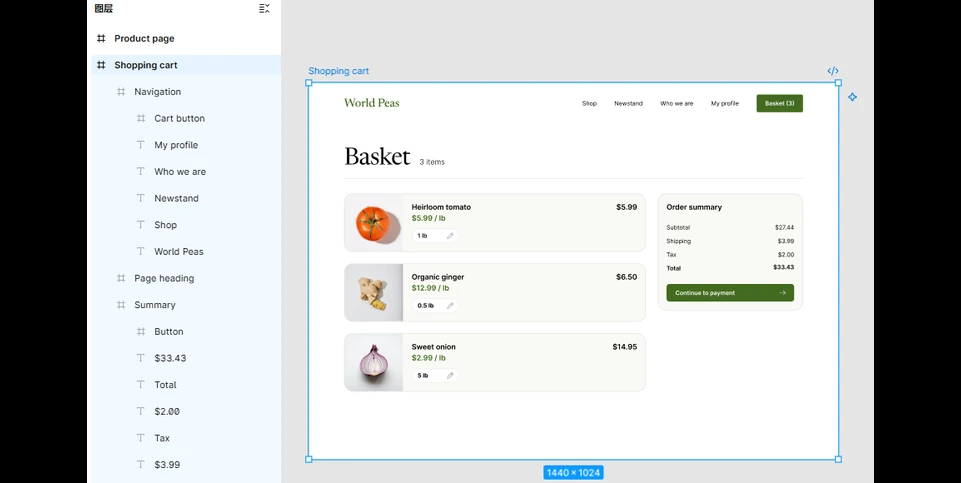

# 🚀 Figma2Unity

> ✨ 将 Figma 的 Page / Frame 快速导入 Unity Canvas 的编辑器插件 MVP。

Figma2Unity 是一个 Unity Package Manager 本地包。推荐优先使用配套 Figma 本地插件导出 `.figma2unity.json` 离线包，再在 Unity 中重建 Canvas 层级、参考图、切图资源、TextMeshPro 文本和 Prefab；同时也保留通过 Figma REST API 在线导入的流程。

## 🌟 功能亮点

| 模块 | 能力 |
| --- | --- |
| 🧭 编辑器入口 | 中文窗口：`Tools/Figma2Unity` |
| 🔐 Figma 连接 | 支持 Figma Personal Access Token 与 File Key / 文件 URL |
| 🖼️ 视觉还原 | 导入完整参考图，自动添加 `CanvasGroup`，默认透明度 `0.5` |
| ✂️ 切图导入 | 导入 PNG 切图资源并设置为 Sprite |
| 📐 坐标还原 | 按 Figma `absoluteBoundingBox` 还原 RectTransform 坐标 |
| 🎯 像素校准 | 使用导出 PNG 实际尺寸和参考图局部匹配校准切图位置 |
| 📄 Manifest | 自动生成 `manifest.json`，支持离线重建场景 |
| 🧯 诊断报告 | 自动生成 `diagnostics.json`，记录导入、展开、合并、跳过原因 |
| 📦 离线包 | ⭐ 推荐导入方式：支持导入 Figma 本地插件导出的 `.figma2unity.json` |
| 🔤 文本导入 | 支持图片、TextMeshPro、智能三种文本模式 |
| 🧠 字体映射 | 项目级全局 TMP 字体映射表，可从 manifest 自动补全字体条目 |
| 🧱 场景管理 | 支持覆盖同名场景根节点 |
| 🧩 Prefab | 支持把导入根节点保存为 Prefab |

## 👀 预览





### 🎬 离线导入演示



## 📦 安装

### 🚀 通过 Git URL 安装（推荐）

在 Unity 中打开：

```text
Window / Package Manager / + / Add package from git URL...
```

输入固定版本地址：

```text
https://gitee.com/furanzhang/figma2unity.git#v0.7.13
```

也可以安装 `master` 最新版本：

```text
https://gitee.com/furanzhang/figma2unity.git
```

包名：

```text
com.frz.figma2unity
```

### 🧳 Figma 离线导出插件

Figma 侧插件作为配套发布包提供，建议从 Gitee Release 下载：

```text
Figma2Unity-Offline-Exporter-v0.7.13.zip
```

解压后在 Figma 中打开：

```text
Plugins / Development / Import plugin from manifest...
```

然后选择解压目录中的：

```text
manifest.json
```

开发调试时，也可以直接选择仓库内的 `FigmaPlugin/manifest.json`。

### 🛠️ 本地安装（开发调试）

如果是本地开发，可以把仓库放在 Unity 项目外部，或 Unity 项目内 `Packages` 目录外，然后在 Unity 中打开：

```text
Window / Package Manager / + / Add package from disk...
```

然后选择本目录下的 `package.json`。

## ⚡ 快速开始

> ⭐ 推荐优先使用 Figma 插件离线包导入：不需要 Figma Personal Access Token，不依赖 REST API 额度，也更适合团队内保存、复现和排查导入结果。REST API 导入更适合作为需要直接从 Unity 拉取设计稿结构时的补充方式。

### ⭐ 推荐：Figma 插件离线包导入

这是更推荐的日常导入方式，尤其适合接口限流、内网代理、团队协作和需要保留导入包的场景。

1. 在 Figma 中打开 `Plugins / Development / Import plugin from manifest...`。
2. 选择本仓库 `FigmaPlugin/manifest.json`。
3. 在 Figma 文件中选中要导入的 Frame / Component / Instance。
4. 运行 `Figma2Unity Offline Exporter`，导出 `.figma2unity.json`。
5. 回到 Unity，打开 `Tools/Figma2Unity`。
6. 设置输出资源目录、目标 Canvas、参考图透明度、容器处理策略、是否保存 Prefab 等 Unity 侧选项。
7. 在“本地导入（Figma 插件包）”中点击 `导入 .figma2unity.json`，选择刚下载的离线包。
8. Unity 会先展示离线包信息，确认后才会写入资源并重建场景。

✅ 这个流程不需要 Figma Personal Access Token，也不会请求 Figma REST API。

离线包确认窗口会展示：

- 节点名、节点类型、根尺寸
- 图片倍率、图片资源数、切图图层数
- 包大小、输出目录
- 大包或图片资源较多时的导入提醒

导入资源会写入：

```text
Assets/FigmaImports/{fileKey}/{selectedNodeId}/
├── reference.png
├── manifest.json
├── diagnostics.json
└── layers/
    ├── 1_2.png
    └── 3_4.png
```

生成场景结构：

```text
Canvas
└── FigmaImport_[Name]_[NodeId]
    ├── Reference
    │   └── DesignReference
    └── Layers
        ├── Layer_[Name]_[NodeId]
        └── ...
```

### 🌐 REST API 导入（可选）

REST API 导入适合希望直接在 Unity 内加载 Figma 文件结构、选择 Page / Frame 并发起导入的场景。

1. 在 Unity 菜单打开 `Tools/Figma2Unity`。
2. 在左列填写 Figma Personal Access Token。
3. 填写 Figma File Key 或 Figma 文件 URL。
4. 设置输出资源目录，默认是 `Assets/FigmaImports`。
5. 如需复用结果，勾选 `保存为 Prefab` 并设置 Prefab 输出目录。
6. 点击 `加载 Figma 文件`。
7. 在 Page / Frame 树中选择要导入的目标。
8. 在“页面 / Frame”区块中点击 `导入选中项`。

> 💡 默认会优先读取本地缓存，减少 Figma API 请求。需要获取最新设计稿时，点击 `强制重新加载`。

如果 Figma API 正在限流，且项目里已有一次成功导入生成的 `manifest.json` 和 PNG 资源，可以在窗口左下角“已导入项目”列表中点击对应项目按钮重建场景。该流程不会请求 Figma，只会使用本地 `reference.png` 和 `layers/*.png` 重新生成 Canvas 层级。

## 🧩 Prefab 输出

- 勾选 `保存为 Prefab` 后，REST API 导入、Manifest 重建、Figma 插件包导入都会在生成场景根节点后额外保存 Prefab。
- 默认 Prefab 输出目录是 `Assets/FigmaImports/Prefabs`。
- Prefab 文件名格式是 `FigmaImport_[Name]_[NodeId].prefab`。
- 勾选 `覆盖同名场景根节点 / Prefab` 时，同名场景根节点和同名 Prefab 会被覆盖。
- 未勾选覆盖时，会生成唯一名称，避免覆盖已有内容。

## ✂️ 切图模式

| 模式 | 说明 |
| --- | --- |
| ⭐ `ExportSettings 优先，并补齐自动切片` | 默认模式。优先保留 Figma 中设置过 Export 的节点，同时补齐未被这些节点覆盖的可见图层。如果带 Export 的 Auto Layout 容器下包含组件实例，导入器会保留容器自身的可见底图，并展开组件实例，避免整个 Auto Layout 被压成一张图。 |
| 🎯 `只导入已设置 Export 的节点` | 只导入设计师标记过导出的节点。如果当前选中的根 Frame 本身也设置了 Export，它会作为最底部背景层导入。 |
| 🔍 `自动切片可见图层` | 遍历可见图层并自动导出图片。 |
| 🖼️ `仅导入整张参考图` | 只生成半透明参考图，不生成 Layers。 |

## 🧱 容器处理策略

该选项主要影响 `ExportSettings 优先，并补齐自动切片`：

| 策略 | 适用场景 |
| --- | --- |
| ✨ `自动` | 默认策略。Auto Layout 容器下有组件实例时，会保留容器自身可见底图，并把组件实例单独导出。 |
| 📌 `严格 ExportSettings` | 设计师标记了哪个节点就优先导出哪个节点，适合需要完全尊重 Figma ExportSettings 的设计稿。 |
| 🛠️ `强制展开容器` | 带子切片的容器会尽量展开到子级，适合排查或避免大容器压成一张图。 |

## 🔤 文本导入模式

| 模式 | 说明 |
| --- | --- |
| 🧠 `智能` | 默认模式。单一样式、纯色、无复杂效果的 Figma Text 会导入为 `TextMeshProUGUI`，复杂文本保留 PNG 切图。 |
| ✍️ `TextMeshPro` | 尽量把 Figma Text 转成可编辑 TMP 文本，即使混合样式或视觉效果可能无法完全还原。 |
| 🖼️ `图片` | 所有 Text 都按 PNG 切图导入，适合需要完全视觉一致的场景。 |

Text 图层会在 manifest 中保留 fallback PNG。切换回 `图片` 模式，或遇到不支持的复杂文本时，Unity 会继续使用这张 PNG。

导入后选中带 `FigmaLayerBinding` 的 TEXT 节点，可以在 Inspector 中：

- 把当前 `TextMeshProUGUI` 转为 fallback PNG `Image`
- 把 PNG 文本图层按 manifest 中的文本元数据转回可编辑 TMP

## 🅰️ 字体映射

Figma 字体不会自动变成 Unity 字体资源。导入器会统一使用项目级全局映射表：

```text
Assets/FigmaImports/FigmaFontMapping.asset
```

首次导入、从 Manifest 重建、从 Figma 插件包导入，都会自动创建或更新这一个映射表。导入窗口右侧会直接显示字体映射管理栏，可执行：

- 更新所有已导入页面
- 编辑映射条目
- 应用映射到选中项
- 应用映射到当前打开场景

更新操作会自动扫描 `Assets/FigmaImports` 下所有导入过的页面 manifest 并补齐字体条目。如果导入后新增了未配置的字体条目，窗口会提示需要为这些条目指定 `FontAsset`。

映射表支持按以下信息匹配到 `TMP_FontAsset`：

- Figma PostScript 名称
- 字体族 + 样式
- 字体族 + 字重范围

条目中最需要手动配置的是 `FontAsset`；Figma 字体族、样式、PostScript 名称、字重、样本文本和使用次数主要用于识别来源和匹配。没有匹配时会使用映射表里的默认字体；如果默认字体也没设置，Unity 会使用 TextMeshPro 组件自己的默认字体。

导入后的文字节点会通过 `FigmaLayerBinding` 回查 manifest 中的 Figma 字体信息。设置好映射后，可以一键把当前场景里的文字节点更新为新的 TMP 字体。

## 🧯 导入诊断报告

每次 REST API 导入、Manifest 重建、Figma 插件包导入都会在输出目录生成：

```text
diagnostics.json
```

诊断报告会记录：

- REST API 导入的节点动作：`导出`、`展开`、`合并`、`跳过`，并写明原因
- Manifest 重建和 Figma 插件包导入时，实际重建的切图层
- 节点没有出现在 Unity 中时，对应 node id 的处理原因

## ⚠️ 注意事项

- 🔐 Token 使用 `EditorPrefs` 保存在本机，不会写入项目资源。
- 🛡️ 如果 Unity 报 `Unable to complete SSL connection`，可在插件窗口临时勾选 `忽略 SSL 证书错误` 后重试。该选项会跳过 HTTPS 证书校验，仅建议在受信任网络或代理环境中使用。
- ⏳ 如果 Figma 返回 `429 Rate limit exceeded`，说明当前 token、seat、plan 或网络出口触发了 Figma REST API 限流。可以等待额度恢复，也可以改用 `FigmaPlugin` 本地插件导出 `.figma2unity.json` 离线包。
- 🧭 插件会把 Figma 文件结构缓存到 Unity 项目的 `Library/FigmaUiImporterCache`，该目录不会进入版本库。导入时会优先使用已加载的节点树，减少额外 API 请求。
- 📣 导入前如果预估切图数量较多，插件会弹窗确认，避免自动切片一次性触发过多图片导出请求。
- 📁 已导入项目列表的离线重建只能使用当前 Unity 项目 `Assets` 目录内的 manifest 和图片资源。如果移动了 `reference.png` 或 `layers` 目录，需要保持 manifest 中记录的相对路径仍然可用。
- 🧳 `.figma2unity.json` 使用 base64 内嵌 PNG，文件会比原始图片总量更大。导入器会校验 manifest 引用、图片路径和 base64 数据，错误信息会指出缺失或损坏的资源。
- 🖼️ 很大的 Frame 建议先用 Figma 插件的“仅导出整张参考图”或“只导出已设置 Export 的节点”。
- 🎯 为了让切图大小和位置更贴近参考图，建议保留 `创建参考图`。没有参考图时，插件仍会使用 PNG 实际尺寸，但无法进行像素位置校准。
- 🧩 插件优先按视觉还原导入；普通 Figma Text 可按文本导入模式转成 TMP，但不会自动生成 Button、Toggle、ScrollView 等语义组件。
- 🗂️ Page 可能很大，建议优先选择具体 Frame。
- 🔗 Figma 图片 URL 有时效，插件会立即下载到 Unity 项目资源目录。

## 🧪 开发验证

仓库包含 Unity EditMode 测试，位于 `Tests/Editor`：

| 测试 | 覆盖范围 |
| --- | --- |
| `FigmaPathUtilityTests` | file key 解析、Assets 路径归一化、导入目录和 Prefab 路径生成 |
| `FigmaImportManifestServiceTests` | manifest 保存与离线重建数据读取 |
| `FigmaDocumentParserTests` | Auto Layout / Instance 切图策略和导入诊断计划 |
| `FigmaImportDiagnosticServiceTests` | `diagnostics.json` 报告写入 |
| `FigmaPluginPackageImporterTests` | `.figma2unity.json` 信息读取、解包、图片写入、资源引用校验、base64 损坏提示和非法资源路径拦截 |
| `FigmaFontMappingServiceTests` | 全局字体映射条目去重、PNG 文本图层元数据收集和 manifest 文本元数据扫描 |

## 🗺️ 推荐工作流

```text
Figma Frame
   ↓
推荐使用 Figma 插件导出 .figma2unity.json 离线包
   ↓
生成 reference.png、layers、manifest.json、diagnostics.json
   ↓
Unity Canvas 层级还原
   ↓
按需保存 Prefab、配置 TMP 字体映射
```

## 📜 License

MIT License © 2026 FRZ

---

Made for Unity UI workflow · ✨ 🚀 🧩
