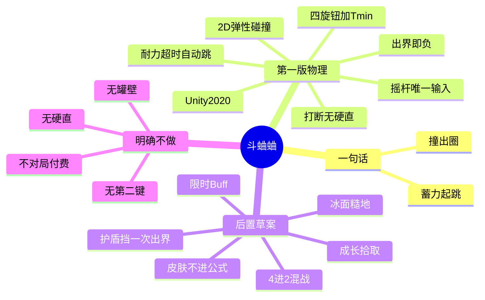
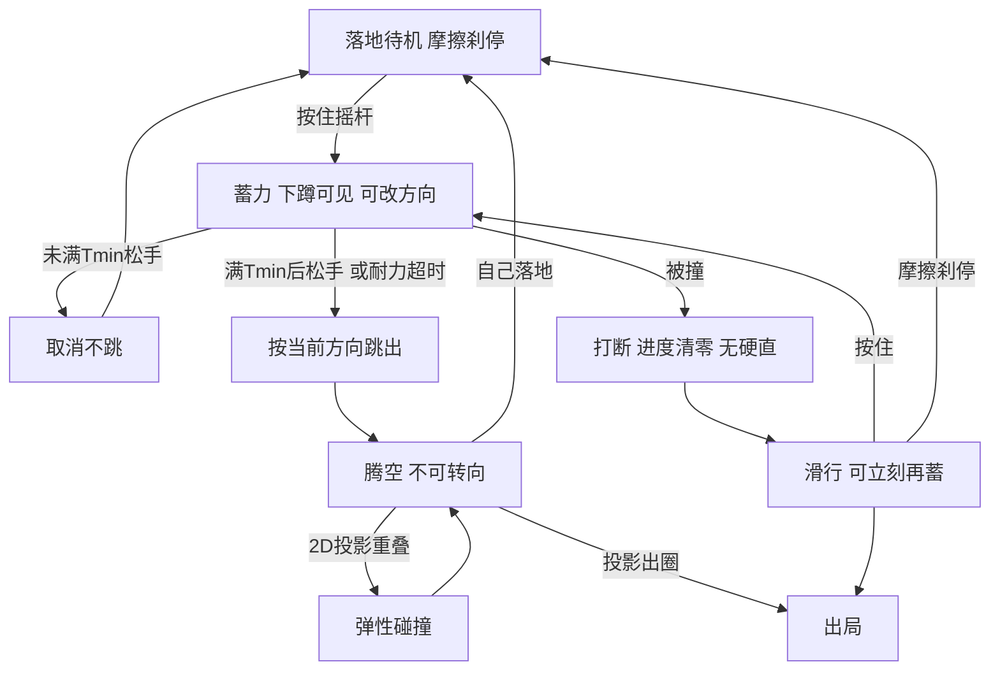
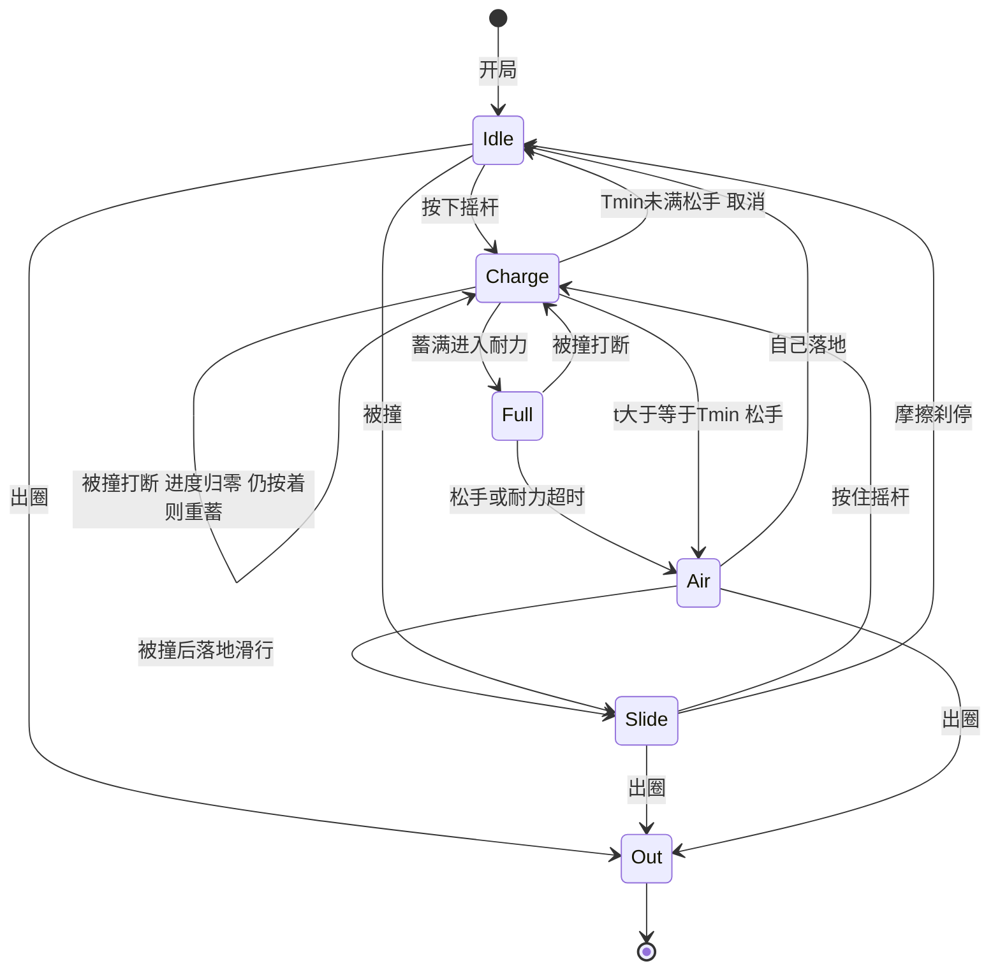
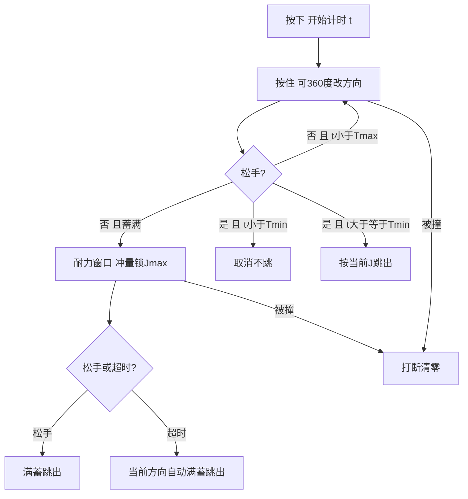
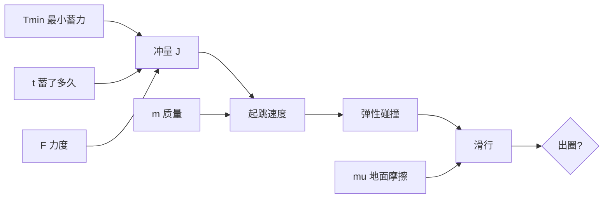
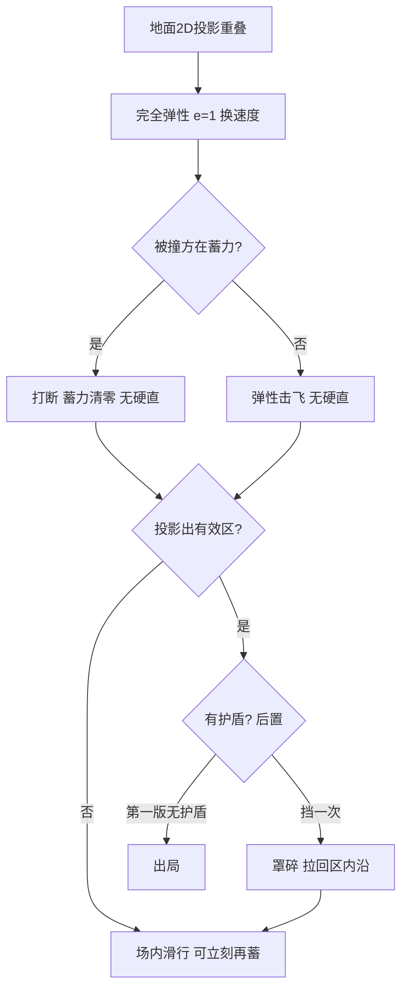
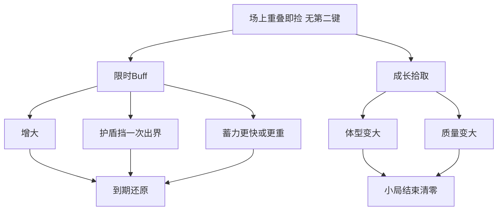
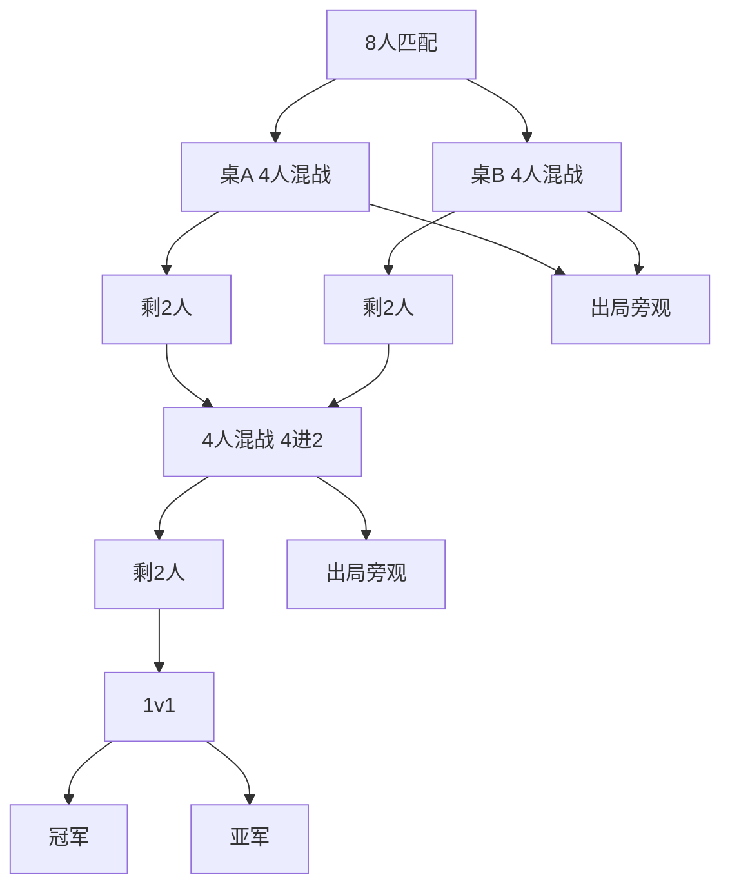
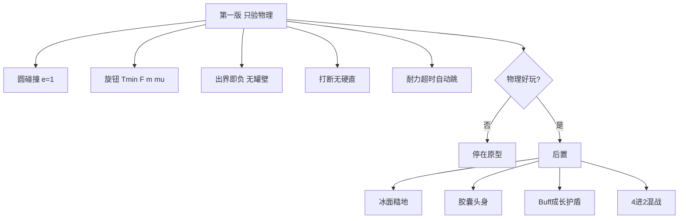

# 斗蛐蛐 · 玩法工作文档

# 斗蛐蛐 · 玩法工作文档

> 日期：2026-08-21 状态：**草案 / 第一版只验物理**（审核 2026-08-21：最小蓄力可配；赛制改 4 进 2 混战） 平台：**Unity 2020**（2D 物理，画面可 3D） 位置：**临时独立原型**（不挂 DeadZone） 目的：把当前脑暴收敛成可对齐的工作稿——做什么、不做什么、卡在哪

---

## 0. 30 秒摘要

1.  **一句话：** 一罐蛐蛐，摇杆蓄力起跳，把人撞出圈；弹性碰撞，读势抢时机。
    
2.  **平台：** Unity 2020。碰撞只做地面 2D，不做 Z 轴高度判定。
    
3.  **镜头：** 近乎俯视，相对竖直轴只偏 **12°–18°**。共享场地镜头，禁止跟拍。
    
4.  **时间结构（已锁）：** 随时可跳的慢速实时对撞。自己跳落地**无后摇**；蓄力必须让对手看得见。蓄满后有耐力窗口，超时按当前方向自动跳出。最小蓄力 `T_min` 可配，含 0。
    
5.  **碰撞：** 物理引擎、完全弹性。蓄力中被撞 **打断蓄力、不进硬直**。
    
6.  **人群：** 30–50 岁、吃策略产品。要读势和抢时机，不要帧战和搓招。
    
7.  **第一版范围：** 只验物理（圆、四旋钮、出界、打断、耐力）。道具 / 地图池 / 赛制全部草案。赛制若上，是 **4 人混战 4 进 2**，没有队伍。
    

### 0.1 总览思维导图

第一版只吃左边「物理」这一枝。右边全是后置。


---

## 1. 设计目的

**目的：** 用一次蓄力方向，把人撞出圈——短、狠、能吹一局。

**人群：** 30–50 岁策略向用户。公平感来自「我算错了 / 我起跳晚了」，不能来自「我按到了但虫飞歪 / 延迟 / 皮肤加伤害 / 豆没刷到我这边」。

**宏观位置：** **临时独立原型，不挂 DeadZone。** 技术真源是 Unity 2020。对局内不付费碾压。皮肤只走外围成长，不进碰撞公式。做完物理验证再决定要不要变成正式产品。

---

## 2. 决策总览

| 维度 | 当前决策 | 状态 | 理由 |
| --- | --- | --- | --- |
| 开发平台 | Unity 2020 | **已锁** | 用户指定本轮 |
| 产品位置 | 临时独立原型，不挂 DeadZone | **已锁** | 做完物理验证再决定要不要转正 |
| 碰撞空间 | 只判地面 2D（XZ / Unity 2D XY）；跳弧视觉保留 | **已锁** | 不要垂直碰撞判定 |
| 碰撞求解 | 物理引擎；虫–虫**完全弹性**（e = 1） | **已锁** | 用户指定本轮；手感先交给物理 |
| 表现控制旋钮 | 蓄力时间（含`T_min`）、质量、地面摩擦、蓄力力度 | **已锁** | 这几个数应能覆盖虫的位移与撞击 |
| 蓄力公式 | 力度随时间线性 → 得到冲量，有上限 | **已锁** | 最大冲量 = 力度系数 × 满蓄时间 |
| 最小蓄力 | `T_min` 进表，**可为 0**，也可配成其他值 | **已锁** | 审核 Gate#1：刹车交给调参，规则不写死非零 |
| 满蓄耐力 | 蓄满后有耐力窗口；超时**按当前方向自动跳出** | **已锁** | 取代力竭乱跳；数字草案可调 |
| 碰撞体 | 先圆，后胶囊；头 / 身分部位冲量系数 | 草案 | 圆先验证弹性；胶囊再做部位差 |
| 蓄力中被撞 | **打断蓄力**；按弹性结算击飞；**不进硬直** | **已锁** | Gate 2 再裁：惩罚丢掉已蓄冲量，不锁操作 |
| 核心动词 | 摇杆长按蓄力 + 方向起跳 | 已锁 | 唯一对局交互 |
| 镜头 | 近俯视，倾角 12°–18° | 已锁 | 跳起有高度，场地仍可读 |
| 相机绑定 | 共享场地镜头，不跟拍 | 已锁 | 竖屏必须看同一只罐 |
| 屏幕 | 手机竖屏 | 已锁 | 用户指定 |
| 时间结构 | 随时可跳的慢速实时对撞（方案 B） | 已锁 | Gate 1 = B |
| 蓄力方向 | 360° 连续可调，松手锁定 | 已锁 | 蓄力时可连续选方向 |
| 跳跃后摇 | 关闭：自己跳落地可立刻再蓄 | 已锁 | 关掉跳跃后的后摇 |
| 静止时 | 落地后靠摩擦停下；摇杆不能走路 | 草案 | 唯一动词是跳 |
| 罐沿 | 无边缘碰撞体；投影出圈即出局 | 已锁 | 出界就输 |
| 道具 | 两类：限时 Buff + 成长拾取 | **草案 / 第一版不做** | 审核 Gate#2：只验物理 |
| 赛制 | 4 人混战**4 进 2**（无队伍）→ 再 4 进 2 → 1v1 | **草案 / 第一版不做** | 审核 Flag#3：去掉 2v2 队伍，晋级只看存活 |
| 地图 | 摩擦（冰 / 糙）+ 形状（圆盘 / 长矩形）进三小局 | **草案** | 同一套物理旋钮换表 |
| 外围奖励 | 皮肤等，不进碰撞公式 | 草案 | 赢了有吹点，公平感不破 |
| 联网 | 每人一部手机，同步看同一场地 | 草案 | 一台竖屏塞多个摇杆不可用 |
| 对局付费强度 | 不做 | 已锁 | 红线：公平感 > 爽感 |
| 第二操作键 | 不做 | 已锁 | 道具是踩到，不是按键 |

---

## 4. 镜头与画面

### 4.1 相机

*   近俯视，相对竖直轴偏 **12°–18°**（不是 45° 斜 45，也不是纯正上方）。
    
*   作用：跳弧和撞飞有体积；圈线、罐沿一眼能读；倾角小，少前后遮挡。
    
*   竖屏构图：场地呈略扁椭圆，近沿在屏幕中下，远沿在中上。
    
*   摇杆只占下缘安全区，不挡场地。
    
*   自己的虫用低饱和描边区分，不靠名字墙。
    
*   蓄力反馈走虫身（压低、鞘翅微张、脚抓沙）+ 地面一小段方向弧，不要准星 UI。蓄力必须是场上所有人都能读的信号。
    

### 4.2 调性

老罐、潮土、灯下一小片沙。要「土得有讲究」，不要卡通吉祥物。30–50 策略用户能接受品相，不能接受儿童昆虫。

Unity 里允许 3D 模型 + 2D 物理：视觉可以有高度，判定永远拍扁在地面。

---

## 5. 核心循环（方案 B · 实时）

```plaintext
落地停在场里（可被撞；摩擦把速度刹停）
  → 拇指按住摇杆，推向要跳的方向（蓄力；虫身下蹲，全场可见）
  → 松开：沿该方向获得冲量跳出（空中不可再改方向）
  → 2D 弹性相撞 / 擦肩 / 出界
  → 自己跳落地：无后摇，可立刻再蓄
  → 被撞：弹性结算；若正在蓄力则 **打断（进度清零）**，不进硬直，可立刻再蓄

```

**唯一输入：** 虚拟摇杆。按住 = 蓄力，方向 = 跳跃向量，松开 = 起跳。松开摇杆且未在蓄力 = 原地等。没有走、没有第二键、没有点地放技能。道具靠身体重叠拾取。

**随时可跳**指：自己跳落地后立刻可以再蓄；被打断后也不进硬直，可立刻再蓄。不必等对手，也不分回合。若打断时仍按着摇杆，视为从 0 重新起蓄（下蹲动作重置）。惩罚是丢掉已蓄冲量，不是锁操作。



### 5.1 虫的状态

| 状态 | 能否蓄力 | 能否被撞 | 玩家看到什么 |
| --- | --- | --- | --- |
| 待机 | 能 | 能 | 站在沙上，摩擦已把速度刹住 |
| 蓄力 | 已在蓄，可改方向 / 松手起跳 | 能；被撞则**打断，进度清零，不进硬直** | 下蹲、方向弧 |
| 满蓄（耐力） | 冲量已是`J_max`，仍可改方向 / 松手跳 | 能；被撞同样打断 | 满蓄信号 + 耐力将尽（发颤）；超时自动跳出 |
| 腾空 | 不能 | 能（仍只判 2D 投影） | 跳弧（视觉） |
| 滑行 | 能 | 能 | 被弹开后在地上滑，摩擦减速；可边滑边蓄 |
| 出圈 | — | — | 淘汰演出 |

**硬直态删除。** 自己跳落地、被撞、被打断，都不锁蓄力。



### 5.2 蓄力 → 冲量

蓄力力度随时间 **线性** 增长。手指按下就开始计时。

```plaintext
J(t) = F × t
J_max = F × T_max

```

*   `t`：按下时长
    
*   `F`：蓄力力度系数
    
*   `T_min`：最小蓄力（**可配，含 0**。第一版默认 0）
    
*   `T_max`：蓄满时间（草案仍 2.0 s）
    
*   `T_stamina`：满蓄后的耐力时间（草案 ~0.8 s，原型可调）
    
*   `J(t)`：这次起跳打到刚体上的冲量
    

`T_min` 规则（已锁）：

*   `T_min = 0`：点一下就是碎跳，和现在一样。
    
*   `T_min > 0`：松手时若 `t < T_min`，**取消、不跳**（进度清掉）。满了 `T_min` 之后，松手才按当前 `J` 跳出。
    
*   数字进表，不写死。要不要刹车，用这一格配，不要另加硬直。
    

时间轴：

| 时间 | 冲量 | 玩家能做什么 |
| --- | --- | --- |
| `0 ≤ t < T_min` | 还在蓄 | 改方向；松手 = 取消不跳（仅当`T_min > 0`） |
| `T_min ≤ t < T_max` | `J = F × t` 线性涨 | 改方向；松手按当前`J` 跳出 |
| `T_max ≤ t < T_max + T_stamina` | 锁在`J_max` | 仍可改方向；松手按满蓄跳出 |
| `t ≥ T_max + T_stamina` | 仍是`J_max` | **自动跳出**：当前方向、满蓄冲量 |

`T_min = 0` 时第一行不存在，点按即跳。方向弧长度等于即将跳出的距离。按满后不是乱跳，是顶着最大冲量等时机；耐力耗尽就自己飞出去。



蓄力期间（含耐力窗口）摇杆指向 **360° 连续** 决定跃出方向，可边蓄边转。松手或耐力超时后，空中不可再改。耐力窗口内被撞：仍按 Gate 2 **打断**，不自动跳。

### 5.3 慢速的时间尺度（草案，原型可调）

这些数是 B 能不能当「策略」的全部。偏短就变成格斗，偏长就发黏。

| 段 | 草案 | 作用 |
| --- | --- | --- |
| 最小蓄力`T_min` | **可配，默认 0** | 0 = 碎跳；>0 = 未满取消不跳 |
| 蓄力→冲量 | `T_min`～2.0 s 线性 | `J = F × t` |
| 满蓄耐力 | 蓄满后再持 ~0.8 s | 冲量锁`J_max`，仍可改方向 |
| 耐力超时 | 超出耐力仍按住 | **按当前方向自动满蓄跳出** |
| 自己跳落地后摇 | **关闭** | 落地可立刻再蓄 |
| 被撞硬直 | **删除** | 打断只清蓄力，不锁操作 |

开局 3 秒只显示场地 + 虫 + 摇杆，倒计时结束即可跳。不要教程墙。

---

## 6. 碰撞（这就是游戏）

### 6.1 空间与引擎

*   **平台：** Unity 2020。推荐 Physics2D（Box2D）或 3D 刚体锁平面；结果必须等价于地面 2D。
    
*   **只判 2D：** 跳弧、高度差只是视觉。投影重叠就算撞上，飞在对方「头顶」也会撞。
    
*   **罐沿不挡人：** 无边缘碰撞体。地面投影超出当前有效区即出局。
    
*   **完全弹性：** 虫–虫碰撞恢复系数 `e = 1`。能量在法线方向守恒，质量不同则按弹性公式分速度。
    
*   **先圆后胶囊：** 第一版碰撞体当圆（2D 圆 / 球在平面上的投影）。验证手感后再换成胶囊（头圆 + 身段）。
    

### 6.2 控制旋钮

虫在场上怎么飞、怎么停、撞多重，原则上只由这些量决定：

| 旋钮 | 符号 | 管什么 |
| --- | --- | --- |
| 最小蓄力 | `T_min` | 未满取消不跳；**可为 0** |
| 蓄力时间 | `t` / `T_max` | 这次出手蓄了多久、满蓄上限 |
| 蓄力力度 | `F` | 单位时间打出的冲量 |
| 质量 | `m` | 同样冲量谁被推得更远 |
| 地面摩擦 | `μ` | 落地后滑多远 |

派生关系：

1.  起跳：给刚体一个冲量 `J = F × t`，方向 = 松手时摇杆方向。
    
2.  空中：2D 速度按弹性碰撞换；摩擦是否作用于腾空 **草案默认否**（摩擦只打在地面接触时）。
    
3.  落地 / 滑行：摩擦力把速度刹向 0。冰面滑得远，粗面很快停。
    
4.  质量变大：同样 `J` 加速度变小，撞轻的虫更亏对方。
    

**验收：** 调这些数，应能覆盖「碎跳（`T_min=0`）、蓄不满取消、满蓄重撞、摩擦刹停」。不要再加第三套运动公式。第一版用同一张默认沙地图，先不要冰/糙。



### 6.3 圆 → 胶囊，头 / 身分部位

| 阶段 | 碰撞体 | 目的 |
| --- | --- | --- |
| 物理验证 | 圆 | 先看纯弹性 + 四旋钮是否好玩 |
| 表现验证 | 胶囊 | 虫有朝向：头前端、身主体 |

胶囊上线后，接触点落在哪一段，给冲量乘一个系数（百分比加减），**不改弹性本身**：

| 接触部位 | 草案系数 | 读法 |
| --- | --- | --- |
| 头撞到对方 | 出手冲量 × (1 + α) | 顶头更「尖」 |
| 身撞到对方 | 出手冲量 × (1 − β) | 身子撞比较肉 |
| 被对方撞到头 | 受击冲量 × (1 + γ) | 草案，可先 = 1 不启用 |
| 被对方撞到身 | 受击冲量 × (1 − δ) | 草案，可先 = 1 不启用 |

α / β 先小（例如 10%–20%），必须能被眼睛学会：「顶到了飞得更远，蹭到身子没那么亏」。系数进表，不进皮肤。

朝向 = 蓄力 / 起跳方向。待机朝向沿用上一次起跳，避免胶囊转成圆。

### 6.4 蓄力中被撞（Gate 2 再裁）

**第一裁：** 打断并击飞，进硬直。 **第二裁：** 受击冲量百分比减免，蓄力不断。 **本裁（已锁）：** **打断蓄力**（进度清零）+ 弹性击飞 + **不进硬直**。

| 情况 | 结果 |
| --- | --- |
| 正面硬刚 | 完全弹性 + 质量差 + 当前速度；相当则对向弹开 |
| 侧撞 / 部位差 | 法线方向弹性换速度；头 / 身系数放大或缩小这次冲量 |
| 撞罐壁 | **无**。沿不挡人 |
| 空中相撞 | 只看 2D 投影 |
| 蓄力中被撞 | **打断**：蓄力清零，下蹲重置；按弹性吃这次撞击；**不进硬直**，可立刻再蓄 |
| 待机 / 滑行被撞 | 全额弹性；同样无硬直 |
| 出圈 | 投影超出有效区即出局；若有护盾，见 §7.1，挡一次后护盾碎 |

打断的可读惩罚是「白蓄了」。若仍按着摇杆，从 0 重新起蓄，必须再看见一次下蹲。



### 6.5 仍禁止

空中二段跳、蓄力时隐身式无动作、垂直方向单独做 3D 碰撞、非弹性「伤害公式」另算一套。

---

## 7. 道具

> **第一版不做。** 审核 Gate #2：只验物理。以下全文是后置草案，不进 Unity 物理原型。

道具不是第二按钮。摇杆还是唯一输入；捡到 = 身体 2D 重叠。

两类，不要合成第三类。



### 7.1 Buff 类（限时）

场上刷新，捡到立即生效，到时结束。当前只这三只，不加第四只：

| Buff | 改哪个旋钮 / 规则 | 玩家读到什么 |
| --- | --- | --- |
| 增大 | 碰撞半径变大（质量是否跟着变**待确认**，草案：半径 + 质量同比例） | 虫变大，更好撞人、更好被瞄 |
| 护盾 | **挡一次出界**（不减免冲量） | 身上有罩；出界那一下罩碎，人还在场里 |
| 蓄力强化 | 加快蓄力（缩短`T_max`）**或** 加大力度 `F`（本轮先当同一条 Buff 的两个子档，不同时叠） | 下蹲更快蓄满 / 同样时间跳得更重 |

Buff 到期回原值。同一只虫同名 Buff **不叠层**，后捡刷新计时。

护盾细则（草案，第一版不做）：

*   不改碰撞冲量，不管质量。
    
*   虫的投影 **刚越出有效区** 时：护盾碎，这次不出局，虫被放到区内沿，速度按摩擦继续滑。
    
*   只挡 **一次**。碎了再出界就是真出局。
    
*   不恢复罐壁碰撞，不拿护盾当弹簧。
    

### 7.2 成长类（像球球 / 蛇）

场上刷可吃物。吃到后 **本小局内** 成长，小局结束清零（不大局跨局带成长，避免滚雪球进决赛）。

成长改什么（草案）：

| 成长 | 改 |
| --- | --- |
| 体型 | 碰撞半径 ↑ |
| 质量 | `m` ↑ |

不直接改 `F`。大虫同样蓄力推得动小虫，但自己更难被推；代价是更好被瞄、更好出界（体积大、贴边亏）。

刷新要稀、要看得见，不能把局变成「谁吃得多谁赢」。目标仍是撞出圈，成长是变奏不是胜负主公式。

### 7.3 投放原则

*   第一版 Unity 物理原型 **没有道具**。弹性先成立，再往场上扔东西。
    
*   道具不能要求第二操作。
    
*   皮肤、外观奖励不是道具，见 §8.3。
    

---

## 8. 赛制、地图、胜负

> **第一版不做赛制和地图池。** 物理原型用一张默认沙、圆盘、4 只虫即可。以下是后置草案。

### 8.1 一大局：4 进 2 混战（无队伍）

审核 Flag #3：去掉 2v2 队伍。名字和规则都是 **4 进 2**——4 人进场，打到剩 2 人。没有队友，没有误伤，谁把谁撞出去都一样。

| 小局 | 形式 | 晋级 | 人数 |
| --- | --- | --- | --- |
| 1 | 4 进 2 × 两场并行 | 每场剩 2 人，合计胜出**4** 人 | 8 人开打 |
| 2 | 4 进 2 × 一场 | 剩**2** 人 | 上场 4 人 |
| 3 | 1v1 | 胜出**1** 人 | 决赛 |

草案规则：

*   没有阵营、没有队友保护、不整队晋级。
    
*   每场打到场上剩 2 人结束，这 2 人晋级。已出局的不复活。
    
*   若几乎同时出界导致只剩 1 人，该 1 人晋级，不补人。
    
*   第一版物理原型甚至不必开 8 人：4 虫一罐，打到剩 1 或测手感即可。
    



### 8.2 小局怎么结束

| 模式 | 结束条件 |
| --- | --- |
| 4 进 2 | 场上剩 2 人；或到时取仍在场、更靠场心的 2 人 |
| 1v1 | 一人出圈；或到时比更靠场心 |
| 小局加时 | 仍僵持则有效区向中心收 |
| 小局硬截止 | 单小局仍不超过约 3 分钟；禁止无限加时 |

单小局目标仍 **70–110 秒** 量级。大局三小局，整场会到数分钟——这是结构成本，匹配和奖励要配得上，不能让人觉得「还没打就累了」。

### 8.3 奖励（外围成长）

赢大局给 **蟋蟀皮肤** 等局外外观。可吹、可收集，**不进质量 / 力度 / 摩擦 / 部位系数**。 对局内付费加速、战力、皮肤加伤害：不做。

### 8.4 地图池（草案，第一版只用默认沙圆盘）

三小局从地图池抽，不要三局同一张。差异只走已经锁定的旋钮和形状，不新开第三套物理。

**摩擦差（改** `**μ**`**）：**

| 地图 | 摩擦 | 玩家读到 |
| --- | --- | --- |
| 冰面 | `μ` 低 | 一撞滑很远，贴边极险 |
| 潮土 / 默认沙 | 中 | 当前手感基线 |
| 糙地 | `μ` 高 | 落地快停，更像贴身相扑 |

**形状差：**

| 形状 | 用途 |
| --- | --- |
| 圆盘 | 默认罐；各向同等 |
| 长矩形 | 长轴好溜、短轴贴边；逼侧撞和走位选择 |

出界规则不变：投影出有效区即负。形状只改有效区，不恢复罐壁碰撞。

---

## 9. 人数、设备、派对怎么成立

*   **默认每人一部手机**，实时同步同一场地。一台竖屏塞多个摇杆，对 30–50 用户不可用。
    
*   房间：好友房 / 匹配。8 人大局必须能人机补位，否则晚上组不起来。
    
*   人机要会瞄准、会贪蓄、会打领先的、会在别人滑向边时补一脚，不当沙包。第一版 4 虫即可，不必 8 人补位。
    
*   联网是 B 的主风险：输入要本地立刻播下蹲；起跳以服务器 / 主机锁定的方向、`t`、`J` 为准。物理以主机为准，不要做需要帧精确对拍的判定。
    

### 9.1 一局情绪（验收用）

| 阶段 | 情绪 | 设计手段 |
| --- | --- | --- |
| 开罐 | 期待 | 看谁在哪 |
| 前 15 秒 | 轻压力 | 试探短跳、看摩擦 |
| 中段 | 释放 + 起哄 | 第一次有人擦边出局 |
| 残局 | 高压 | 贴边互盯蓄力；4 进 2 剩三人 |
| 终局 | 高潮 | 最后一撞或收圈 |
| 结算 | 可吹 | 回放「决定性一撞」 |

随机性留在碰撞夹角、别人何时松手。不要暴击、不要抽技能。第一版不要道具随机。

---

## 10. 策略深度（不加按钮）

从一个动词挤决策：

1.  **打谁：** 打领先 / 打威胁自己的。4 进 2 没有队友。
    
2.  **打哪：** 正撞换速度，侧撞把人送去边。
    
3.  **打多重：** 蓄多久 → `J` 多大；空过也是选择。`T_min` 配高了就不能碎跳连打。
    
4.  **何时跳：** 看对方下蹲。打中蓄力中的虫 = 打断（白蓄），自己无后摇。
    

局外皮肤以后可以换皮。第一版四只虫开局同模同数值。

---

## 11. 明确不做

*   对局付费碾压、皮肤进碰撞公式
    
*   第二操作（点地、技能键、双摇杆、用摇杆走路）
    
*   跟拍镜头、自由旋转镜头
    
*   无下蹲预兆的即时乱撞
    
*   Z 轴 / 高度单独碰撞
    
*   非弹性的「伤害表」另算一套（第一版坚持 e = 1）
    
*   空中转向、二段跳
    
*   用签到 / 体力把这局卡成 KPI 水龙头
    
*   品系相克、喂食养成、装备（砍掉也不影响「撞出圈」）
    
*   大局跨小局继承成长 / Buff（会让决赛未打先定）
    
*   出局复活再晋级
    
*   2v2 队伍 / 队友误伤 / 卖队友晋级（已改成 4 进 2 混战）
    
*   被撞硬直、蓄力中被撞仍带着进度飞
    
*   护盾当冲量减免或罐壁弹簧
    
*   蓄满后力竭乱跳一小段（已改成耐力超时、满蓄自动跳出）
    
*   **第一版不做：** 道具、成长、护盾、胶囊部位、地图池、8 人三小局
    

**后置草案（不进第一版）：** 限时 Buff、成长拾取、护盾挡一次出界、4 进 2 赛制。

---

## 12. 审核摘要（2026-08-21 · 制作人已答）

方法：Purpose / Rhythm / RedLine / Value 并行。Segment、Economy 不适用。综合 **6/10**（答前）。答后范围已收。

| 层 | 结论 |
| --- | --- |
| 目的清不清 | 一句话成立。第一版只验这一句。 |
| 宏观适不适应 | 已锁：临时独立原型，不挂 DeadZone。 |
| 微观有没有目标 | 第一版：把人撞出圈。赛制后置才是 4 进 2。 |

**制作人裁决（已写入正文）：**

| # | 类型 | 问题 | 裁决 |
| --- | --- | --- | --- |
| 1 | Gate | 慢速读势 vs 碎跳连打 | `**T_min**` **可配，含 0。** 不写死非零；要刹车调这一格，不加硬直 |
| 2 | Gate | 第一版验什么 | **只验物理。** 道具 / 地图池 / 赛制全部草案 |
| 3 | Flag | 2v2 卖队友 | **要改：就是 4 进 2。** 无队伍、无队友 |

连打风险交给 `T_min`：默认 0 先看有没有人敢蓄满；碎跳成灾再把 `T_min` 拉离 0。不要偷偷加硬直。

---

## 13. 待确认

### Gate 1 — 时间结构（已裁决）

*   **裁决：** B。随时可跳的慢速实时对撞。
    
*   **不采用：** A 拍制、C 观赏对战。
    

### Gate 2 — 蓄力中被撞（再裁，已锁）

*   **第一裁：** 打断 + 击飞 + 硬直。
    
*   **第二裁：** 冲量减免、蓄力不断。
    
*   **本裁：** **打断蓄力，去掉硬直。** 进度清零，弹性照算，可立刻再蓄。
    
*   **不采用：** 带着蓄力飞；受击冲量百分比减免当主规则；被撞硬直。
    

### 本轮已锁

*   Unity 2020；2D 碰撞；完全弹性；蓄力线性冲量。
    
*   蓄力中被撞 = 打断、无硬直。
    
*   `T_min` 可配，含 0；未满取消不跳。
    
*   蓄满后有耐力时间，超时按当前方向自动跳出。
    
*   **第一版只验物理**（圆、旋钮、出界、打断、耐力）。
    
*   赛制后置形态 = **4 进 2 混战**，无队伍。
    
*   **不挂 DeadZone**，临时独立原型。
    

### 仍待拍

1.  物理原型里 `T_min` 默认就用 0，还是先给一个非零试刹车？
    

后续不展开：匹配人机补位细则、皮肤商城。

---

## 14. 原型

### 14.1 现有 H5（手感参考，不再当真源）

`docs/dou-ququ/prototypes/index.html`

浏览器打开。方向键 / WASD 长按蓄力、松开跳；触屏底部摇杆。P2 热座 IJKL。 H5 仍是「打断 + 硬直」和圆碰撞，**与本轮「打断、无硬直」不完全一致**。新真源改 Unity 2020。

### 14.2 Unity 2020 验证顺序

1.  **第一版（本轮只做这个）：** 圆、e = 1、旋钮、出界即负、无罐壁；蓄力线性冲量、`T_min` 可配、方向 360°、落地无后摇、蓄力中打断且无硬直；满蓄耐力超时自动跳出。默认沙圆盘，4 虫。
    
2.  后置：冰 / 糙摩擦表。
    
3.  后置：胶囊 + 头身系数。
    
4.  后置：Buff / 成长 / 护盾。
    
5.  后置：4 进 2 混战 → 再 4 进 2 → 1v1。
    


---

## 15. 原型验收

### 15.1 物理阶段（先过这个，再做道具和赛制）

*   [ ] Unity 2020；碰撞只在地面 2D，跳过对方头顶仍会撞
    
*   [ ] 只会用摇杆就能打完一小局，无第二键、不能走路
    
*   [ ] 蓄力 
    
*   [ ] 
    
*   [ ] 蓄满后有一段耐力；对手看得出「马上要被逼跳」；超时按当前方向满蓄自动跳出，不是乱跳
    
*   [ ] 只调 
    
*   [ ] 虫–虫是弹性对撞，不是伤害数字
    
*   [ ] 打中正在蓄力的虫：对方跳不出去（蓄力清零），被弹性推开，无硬直，可立刻再蓄
    
*   [ ] 自己跳落地后可立刻再蓄；被打断后仍按着摇杆则从 0 重新下蹲
    
*   [ ] 倒计时结束 3 秒内能完成第一次起跳，无教程墙
    
*   [ ] 别人蓄力时，自己来得及看见下蹲再决定跟不跟
    
*   [ ] 出界即负；无罐壁弹回
    
*   [ ] 30–50 用户试玩后能说出「我起跳晚了 / 我方向错了」而不是「摇杆不准 / 卡」
    

### 15.2 后置（胶囊 / 道具 / 赛制）

*   [ ] 头撞和身撞肉眼可分
    
*   [ ] 三只 Buff 限时、到期还原；护盾只挡一次出界；成长小局清零
    
*   [ ] 冰面和糙地、圆盘和长矩形，用同一套物理换表
    
*   [ ] 4 进 2：4 人混战打到剩 2 人；无队伍、无复活
    
*   [ ] 大局打完有一个冠军；奖励是皮肤不是数值
    

---